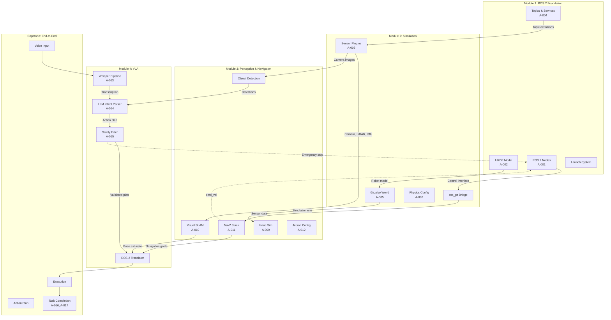

# Capstone Data Flow Map



## Inter-Module Contracts

| From | To | Interface | Message Type |
|------|-----|-----------|-------------|
| Module 1 | Module 2 | URDF → Gazebo spawn | `robot_description` topic |
| Module 2 | Module 3 | Sensor data | `sensor_msgs/Image`, `LaserScan`, `Imu` |
| Module 3 | Module 4 | Object detections | `vision_msgs/Detection2DArray` |
| Module 3 | Module 4 | Robot pose | `nav_msgs/Odometry` + TF |
| Module 4 | Module 3 | Navigation goals | `geometry_msgs/PoseStamped` |
| Module 4 | Module 1 | Joint commands | `sensor_msgs/JointState` |
| Safety | All | Emergency stop | `std_msgs/Bool` on `/emergency_stop` |

## Artifact Dependency Chain

```
A-001 (ROS 2 workspace)
  └── A-002 (URDF) ──► A-005 (Gazebo world)
       └── A-006 (Sensors) ──► A-010 (VSLAM)
            └── A-011 (Nav2) ──► A-013 (Whisper)
                 └── A-014 (LLM) ──► A-015 (Safety)
                      └── A-016 (Capstone integration)
                           └── A-017 (Evaluation)
```
