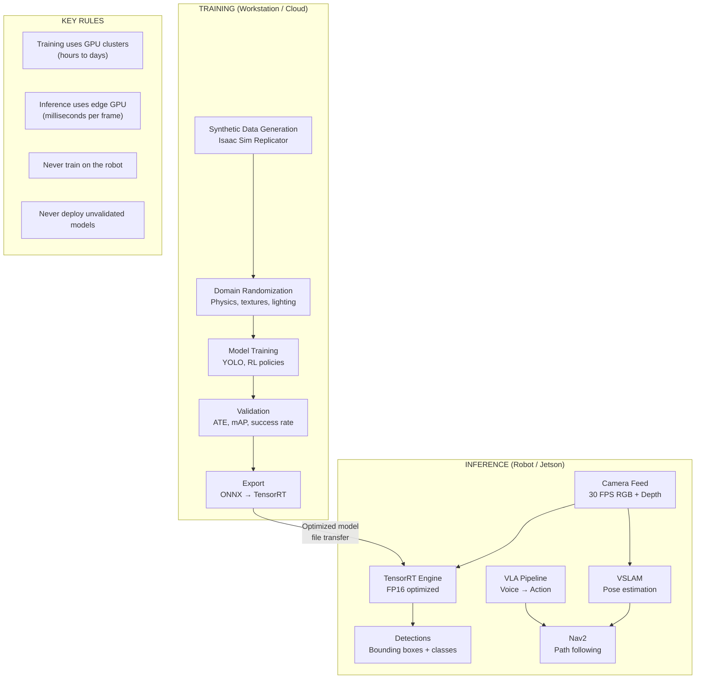

# Training vs Inference Separation

## Separation Rules

| Concern | Training | Inference |
|---------|----------|-----------|
| **Hardware** | RTX 4090 / A100 / Cloud | Jetson Orin NX/AGX |
| **Precision** | FP32 (accuracy) | FP16 (speed) |
| **Batch size** | 16-128 | 1 (single frame) |
| **Latency** | Not critical | < 100 ms required |
| **Data** | Synthetic + real labeled | Live sensor stream |
| **Output** | Model weights (.pt) | Predictions per frame |
| **Location** | Off-robot | On-robot |
